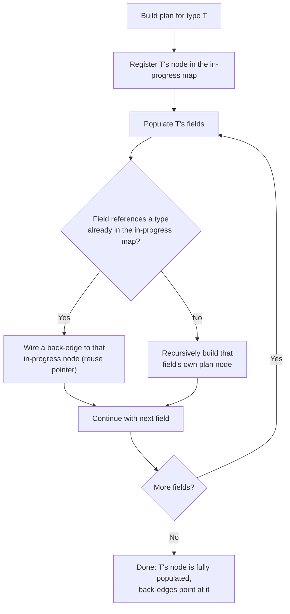
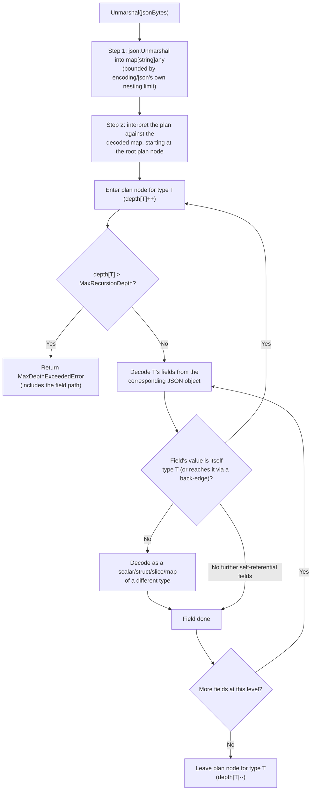
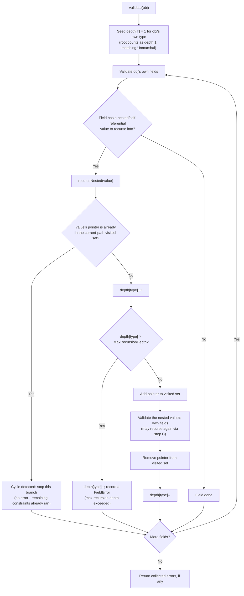

# Cyclic and Nested Types

How Pedantigo handles self-referential (recursive) and deeply nested struct types during `Unmarshal` and `Validate`, and how it protects against recursion-based denial of service.

## Overview

A self-referential type is one that (directly or through other types) contains a field of its own type, usually via a pointer or a slice/map of pointers:

```go
type Comment struct {
    Body    string     `json:"body" validate:"required"`
    Replies []*Comment `json:"replies" validate:"dive"`
}
```

Pedantigo supports this pattern for both JSON decoding (`Unmarshal`) and struct validation (`Validate`). Both paths share the same build-time strategy for discovering the cycle, but they apply different runtime termination rules, because they are guarding against different things:

- **Unmarshal** is bounded by the JSON payload itself — the decoded data is a finite tree, so it terminates naturally. The recursion cap here defends against a JSON payload that is itself absurdly deep.
- **Validate** walks in-memory Go values, which is not automatically finite — a real pointer cycle (`comment.Replies[0] == comment`) would make an unbounded walker loop forever. The recursion cap here is what makes termination guaranteed at all.

## Build Time: Discovering the Cycle

Both `Unmarshal` and `Validate` precompute their work for a type once, the first time a `Validator[T]` is created (`New[T]()`), rather than re-walking the type with reflection on every call. Building that precomputed plan requires knowing when a type refers back to itself, so a cyclic type doesn't send the builder into infinite recursion.

Both paths use the same **register-before-populate** technique: when the builder starts building the plan node for a type, it registers that (still-empty) node in a map keyed by type *before* it recurses into the type's fields. If a field's type is encountered again while its own node is still being populated, the builder reuses the in-progress node instead of building a new one — that reused pointer is the back-edge that closes the cycle in the plan graph.



The result is a small, cyclic graph of plan nodes — one node per distinct type reachable from `T`, built exactly once, reused on every subsequent `Unmarshal`/`Validate` call.

## Runtime: Unmarshal

`Unmarshal` interprets the precomputed plan against the decoded JSON value. Because the JSON itself is a finite tree (an object can't literally contain itself), the interpreter's recursion always terminates on the data — but a pathological payload can still nest hundreds or thousands of levels deep, so a depth cap is enforced as it walks:



The depth counter tracks **re-entry into the same self-referential plan node along the current path** — it is keyed by the type's plan node, not by the overall JSON nesting level, so unrelated struct/slice/map nesting through *other* types is not counted against the cap. The outermost object passed to `Unmarshal` counts as depth 1; each further level of the *same* recursive type adds one more.

## Runtime: Validate

`Validate` walks an already-constructed Go value using the same kind of precomputed field cache, following `NestedCache` links (the validate-side equivalent of the plan's back-edges) into nested and self-referential fields. Because this walks real pointers, a genuine in-memory cycle (`a.Next == a`, or a longer cycle `a → b → a`) is possible and must be broken explicitly, not just bounded:



Two details matter here:

- **The visited set is add-on-enter, remove-on-leave**, scoped to the current path being walked — not a global "already validated" set. This means a **diamond** (two different fields pointing at the *same* shared sub-object, with no cycle back to an ancestor) is validated twice, once through each field, rather than being skipped the second time as if it were a cycle. If that shared sub-object is invalid, both branches report it.
- **The object passed directly to `Validate()` counts as depth 1**, the same convention `Unmarshal` uses for its outermost object — each further level of the same self-referential type through `recurseNested` adds one more (depth 2, 3, ...). The two counters still answer different questions under the hood (JSON tree depth of `T` in the payload vs. how many times `Validate` re-enters `T`'s own field cache while walking live pointers), but they now agree on where counting starts, so the same `MaxRecursionDepth` value admits the same tree shape on both paths.

## Configuring the Depth Cap

The self-referential recursion cap is `Options.MaxRecursionDepth`, and it applies to both `Unmarshal` and `Validate`:

```go
type Comment struct {
    Body    string     `json:"body" validate:"required"`
    Replies []*Comment `json:"replies" validate:"dive"`
}

// Default cap (3): comment threads more than 3 levels deep are rejected.
v := validator.New[Comment]()

// Raise the cap for a use case that legitimately needs deeper nesting.
v := validator.New[Comment](validator.Options{
    StrictMissingFields: true,
    MaxRecursionDepth:   10,
})
```

A zero or negative `MaxRecursionDepth` falls back to the default of 3. Exceeding the cap returns a `*MaxDepthExceededError` (surfaced as a `FieldError` from `Validate`, or as part of the decode error from `Unmarshal`) rather than a panic or a hang — it's an ordinary, catchable validation failure.

The cap only bounds recursion through the **same self-referential type**. Nesting through distinct types (`Order` containing an `Address` containing a `Country`) is not limited by it at all — only a type that can recursively contain itself is subject to the cap.

## Security: Why a Depth Cap, Not Just a Size Limit

A byte-size or field-count limit on the input does **not** protect against a deeply recursive payload. A JSON array nested 1,000 levels deep (`[[[[...]]]]`) is roughly 2 KB of text, well under any reasonable request-size limit, yet decoding or walking it naively can consume enormous stack space or CPU. This is a distinct DoS class from "the input is too big" — it's "the input is too *deep*" — and it's tracked as [CWE-674 (Uncontrolled Recursion)](https://cwe.mitre.org/data/definitions/674.html) and [CWE-121 (Stack-based Buffer Overflow)](https://cwe.mitre.org/data/definitions/121.html).

`Unmarshal`'s first step (decoding JSON text into `map[string]any`) already inherits Go's `encoding/json` scanner's own built-in nesting limit, so a raw wall of brackets is rejected before it ever reaches Pedantigo's own logic. `Options.MaxRecursionDepth` protects the layer *after* that: Pedantigo's own recursive interpretation of the decoded value (Unmarshal's plan interpreter) and its own recursive struct/pointer walk (`Validate`). Without it, a payload or in-memory value that stays within the stdlib's decode limits could still drive Pedantigo's own recursion arbitrarily deep — and, on the `Validate` side, a genuine pointer cycle could make that recursion literally never terminate without the visited-pointer cycle guard described above.

None of the incumbent Go validation libraries (`go-playground/validator`, `ozzo-validation`, `Huma`) bound the depth of nested-reference validation — a struct that validates a self-referential or deeply nested type against one of them inherits whatever native Go recursion limit the runtime happens to hit first, which is exactly the class of failure the CVEs below were filed for.

### Related CVEs and issues

Uncontrolled recursion in tree/graph-shaped decoders is a recurring, cross-language vulnerability class, not a theoretical concern:

- **Jackson (Java)** — [CVE-2025-52999](https://www.herodevs.com/blog-posts/cve-2025-52999-denial-of-service-via-stack-overflow-in-jackson-core): denial of service via stack overflow in `jackson-core`.
- **Newtonsoft Json.NET (.NET)** — [CVE-2024-21907](https://www.sentinelone.com/vulnerability-database/cve-2024-21907/): stack overflow from deeply nested JSON.
- **Oj (Ruby)** — [GHSA-3m6q-jj5j-38c9 / CVE-2026-54592](https://github.com/ohler55/oj/security/advisories/GHSA-3m6q-jj5j-38c9): unbounded recursion during parsing.
- **Unleash (Node.js)** — [CVE-2026-63462](https://cvereports.com/reports/CVE-2026-63462): denial of service via deeply nested input.

The most on-point precedent, because it's the same language and the same standard library Pedantigo builds on, is Go's own `encoding` packages — which have hit this exact bug class repeatedly, and had to add recursion-depth guards after the fact:

- **`encoding/xml` `Unmarshal`** — [CVE-2022-30633](https://github.com/golang/go/issues/53611): stack exhaustion from deeply nested XML.
- **`encoding/xml` `Decoder.Skip`** — [CVE-2022-28131](https://github.com/golang/go/issues/53614): stack exhaustion via a crafted, deeply nested document.
- **`encoding/gob` `Decoder.Decode`** — [CVE-2022-30635](https://www.cvedetails.com/cve/CVE-2022-30635/): stack exhaustion via a deeply nested structure.
- **`encoding/gob` `Decoder.Decode`** — [CVE-2024-34156](https://github.com/golang/go/issues/69139): the fix for CVE-2022-30635 was incomplete and had to be reopened — a reminder that hand-rolled recursion guards are easy to get subtly wrong.
- **`go/parser`** — [CVE-2022-1962](https://osv.dev/vulnerability/CVE-2022-1962): stack exhaustion from deeply nested Go source.
- **`encoding/json`** — [golang/go#31789](https://github.com/golang/go/issues/31789): no CVE was assigned, but this issue is what motivated the scanner's own `maxNestingDepth`, after deeply nested JSON was shown to risk a 5-17 MB stack allocation.

`Options.MaxRecursionDepth` exists so that Pedantigo does not have to be the next entry on this list.

## Next Steps

- See [Validation Basics](/docs/concepts/validation) for the overall validation pipeline.
- See [Cross-Field Validation](/docs/concepts/cross-field) for `Validatable` and multi-field rules.
